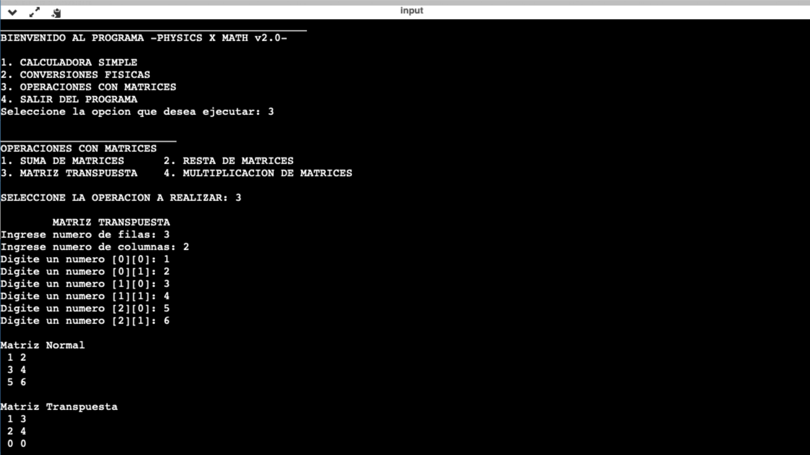

# 🚀 PROYECTO FINAL - PHYSICS X MATH 2.0 🧮

[](https://www.ipn.mx/)
[](https://isocpp.org/)
[](https://opensource.org/licenses/MIT)

## 📌 Descripción
**Escuela:** Instituto Politécnico Nacional (IPN)  
**Carrera:** Ingeniería Mecánica  
**Materia:** Fundamentos de Programación  
**Fecha de Finalización:** 13 de Junio de 2021  

### 👥 Desarrolladores
1. VLJM
2. VGE
3. VPI
4. VCL
5. VRDE

---

## 📝 Información
**PHYSICS X MATH 2.0** es un programa en C++ que desarrolle con mi equipo de clase cuando era parte del **Instituto Politécnico Nacional** como proyecto final de la materia *Fundamentos de Programación*. El software integra herramientas de cálculo matemático y conversiones físicas en una interfaz de menú interactiva, dirigido a estudiantes de ingeniería y ciencias.

### 🔍 Funcionalidades Principales:
1. **Calculadora Simple:** Operaciones básicas (suma, resta, multiplicación, división, potencias, raíces).  
2. **Conversiones Físicas:**  
   - Área (m², cm², km²).  
   - Masa (kg, g, lb, oz, toneladas).  
   - Volumen (km³, m³, cm³, etc.).  
   - Longitud (m, pies, yardas, millas).  
   - Temperatura (°C, °F, K).  
3. **Operaciones con Matrices:**  
   - Suma, resta, multiplicación y matriz transpuesta.  

---

## 🛠️ Instalación y Ejecución
### Requisitos:
- Compilador de C++ (g++, clang, o IDE como Code::Blocks/Dev-C++).  
- Sistema operativo Windows/Linux/macOS.  

### Pasos:
1. Clona el repositorio:
   ```bash
   git clone https://github.com/tu-usuario/jesusvasquezjr3/PHYSICS-X-MATH-2.0.git
   ```
2. Compila el código:
   ```bash
   g++ main.cpp -o physics_x_math -lm
   ```
3. Ejecuta el programa:
   ```bash
   ./physics_x_math
   ```
---

## 🎯 Uso del Programa
1. **Menú Principal:** Selecciona entre calculadora, conversiones o matrices.  
2. **Submenús:** Cada módulo ofrece opciones específicas con instrucciones en pantalla.  
3. **Ejemplo de Conversión de Temperatura:**  
   ```plaintext
   > Seleccione: 2 (Conversiones Físicas) > 5 (Temperatura) > 1 (°C a °F/K).
   > Ingrese grados Celsius: 25
   > Resultado: 25°C = 77°F = 298.15K
   ```

---

## 📊 Capturas


*Figura 1: Portada del proyecto*


*Figura 2: Análisis*


*Figura 3: Diseño*


*Figura 4: Funcionamiento*

---

## 📜 Licencia
Este proyecto está bajo la licencia [MIT](LICENSE).  
